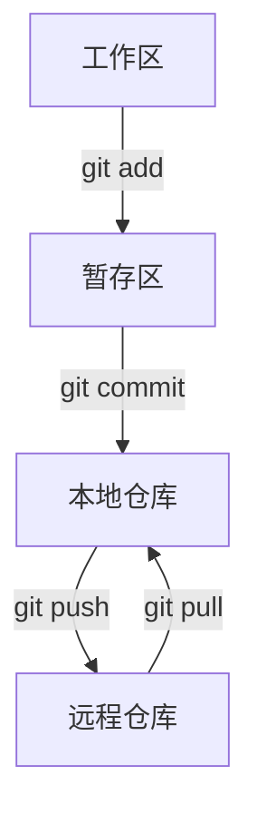

# Git 实际开发流程详细讲解

## 场景说明
以开发一个 Python 项目并推送到 GitHub 为例，演示完整的 Git 工作流，包括初始化、提交、分支、协作等。

---

## 1. 初始化本地仓库

### 步骤
1. 打开终端，进入你的项目文件夹：
   ```bash
   cd python_learn
   ```
2. 初始化 Git 仓库：
   ```bash
   git init
   ```
   > 这会在当前目录下生成一个 `.git` 文件夹，表示这里是一个 Git 仓库。

### 注意事项
- 只需初始化一次。
- 初始化后，所有 Git 操作都在该目录下进行。

---

## 2. 添加文件到暂存区

### 步骤
1. 查看当前状态：
   ```bash
   git status
   ```
2. 添加所有文件到暂存区：
   ```bash
   git add .
   ```
   > `.` 表示添加当前目录下的所有更改文件。

### 注意事项
- 也可以只添加某个文件：`git add 文件名`
- 暂存区是 Git 的中间缓冲区，只有 add 过的文件才会被提交。

---

## 3. 提交到本地仓库

### 步骤
1. 提交暂存区内容到本地仓库：
   ```bash
   git commit -m "第一次提交：添加了学生类和相关功能"
   ```
   > `-m` 后面跟的是本次提交的说明，建议写清楚做了什么更改。

### 注意事项
- 每次提交都会生成一个唯一的 commit id。
- 提交后，文件历史被永久记录，可随时回退。

---

## 4. 关联远程仓库（以 GitHub 为例）

### 步骤
1. 在 GitHub 上新建一个空仓库，比如 `python_learn`。
2. 关联本地仓库和远程仓库：
   ```bash
   git remote add origin https://github.com/你的用户名/python_learn.git
   ```
   > 只需做一次，origin 是远程仓库的默认别名。

### 注意事项
- 远程仓库地址必须正确。
- 可以用 `git remote -v` 查看远程仓库信息。

---

## 5. 推送代码到远程仓库

### 步骤
1. 首次推送主分支：
   ```bash
   git push -u origin main
   ```
   > `-u` 让本地 main 分支和远程 main 分支建立跟踪关系，后续只需 `git push`。

### 注意事项
- 如果远程分支名是 master，需改为 `git push -u origin master`。
- 推送前建议先 `git pull`，避免冲突。

---

## 6. 日常开发流程

### 步骤
1. 修改或新增代码。
2. 查看状态：
   ```bash
   git status
   ```
3. 添加更改到暂存区：
   ```bash
   git add .
   ```
4. 提交更改：
   ```bash
   git commit -m "新增BMI计算功能"
   ```
5. 推送到远程仓库：
   ```bash
   git push
   ```

### 注意事项
- 每次提交都应写明本次更改内容。
- 推送前建议先拉取远程最新代码：`git pull`。

---

## 7. 分支开发与协作

### 创建和切换分支
```bash
git checkout -b feature-bmi
```
> 新建并切换到 `feature-bmi` 分支。

### 在分支上开发
```bash
git add .
git commit -m "开发BMI功能"
git push origin feature-bmi
```
> 推送分支到远程，便于协作。

### 合并分支
1. 切回主分支：
   ```bash
   git checkout main
   git pull
   ```
2. 合并功能分支：
   ```bash
   git merge feature-bmi
   ```
3. 推送合并结果：
   ```bash
   git push
   ```

### 删除分支
```bash
git branch -d feature-bmi      # 删除本地分支
git push origin --delete feature-bmi  # 删除远程分支
```

### 注意事项
- 合并时如有冲突，需手动解决后再提交。
- 分支开发有助于多人协作和功能隔离。

---

## 8. 查看历史与回滚

### 查看提交历史
```bash
git log
```

### 查看文件改动
```bash
git diff
```

### 回退到某次提交
```bash
git reset --hard <commit_id>
```
> 慎用，回退后不可恢复。

---

## 9. 常见问题与技巧

- **冲突解决**：合并分支时如有冲突，Git 会标记冲突文件，需手动编辑解决。
- **忽略文件**：在 `.gitignore` 文件中列出不需要纳入版本控制的文件或文件夹。
- **标签管理**：`git tag v1.0` 给重要提交打标签。
- **远程仓库变更**：可用 `git remote set-url origin 新地址` 修改远程仓库地址。

---

## 10. 工作流程图



---

## 11. 总结
- Git 是现代开发必备技能，建议多练习。
- 养成良好的提交和分支管理习惯。
- 遇到问题多查官方文档或社区。

---

如需更详细的命令解释或遇到具体问题，欢迎随时提问！ 